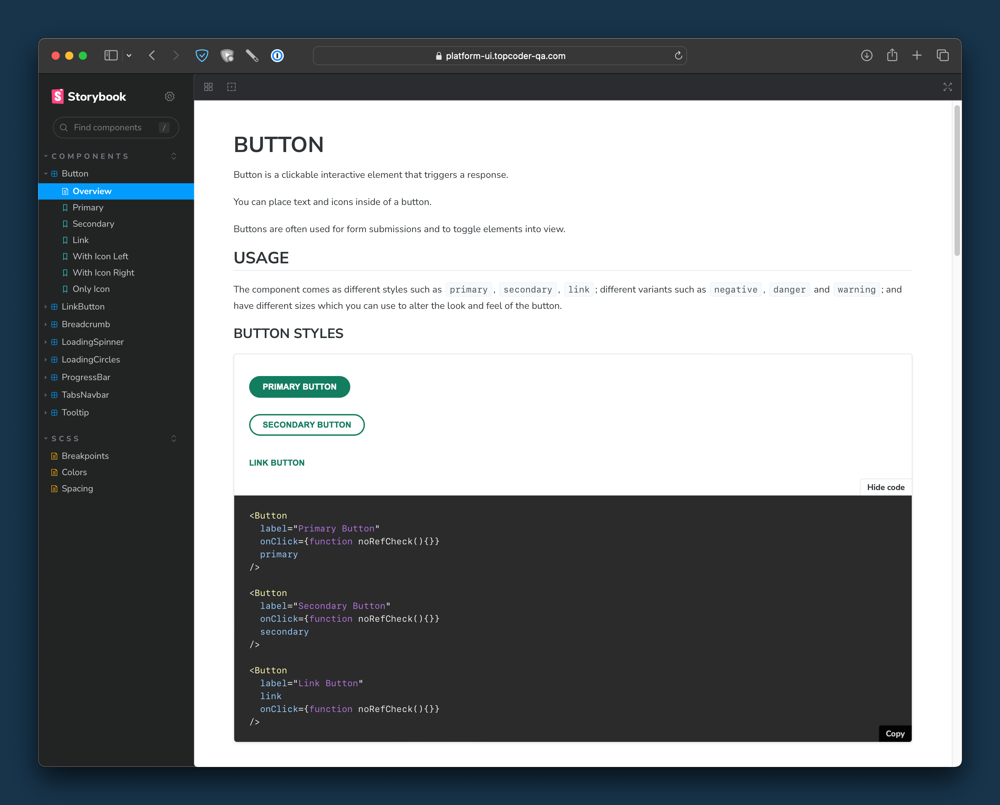
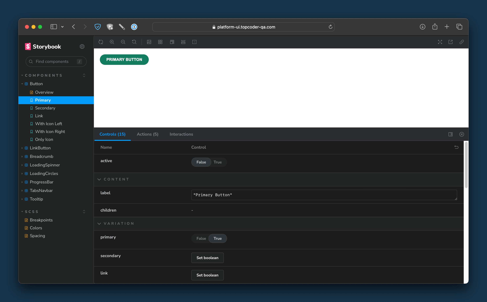
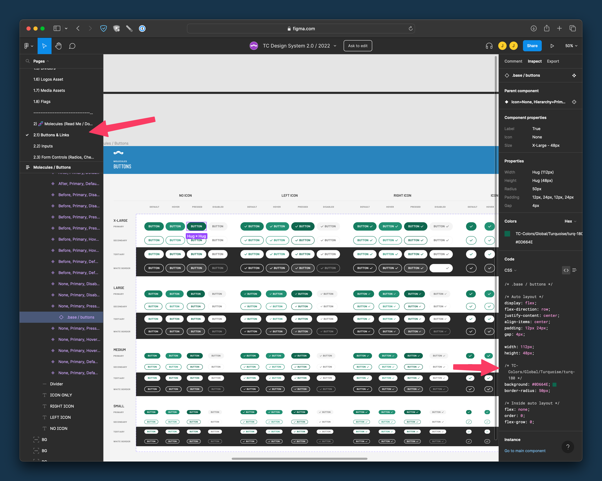

# Platform UI Storybook

The platform UI app will be the new application that contains the majority of the Topcoder applications.  It's built in a modular, consistent way, using modern techniques and technologies.

A big part of the platform UI app is a consistent UI / UX experience through shared components like buttons, tabs, tooltips, dropdowns, checkboxes, etc...

To aid in development, we've built a storybook that can help designers and developers investigate those components and ensure that they are used consistently, with a minimum of custom code necessary.

## Storybook

The storybook can be found [here](https://platform-ui.topcoder-qa.com/storybook/index.html)

On this page, you can see the UI elements available to developers in the Platform UI app, all the variations, and all the available styles.

You can also get code by using the `Show code` button underneath examples on the Overview page.

### Individual testing

If you want to test individual elements, for instance, the "Primary" option under "Button", you can click that and then you have controls at the bottom of the page that allow you to edit individual properties on the control and see the result, for easy validation.

## Figma 

The Topcoder Design System is what defines the individual components and colours for the platform UI.  You can find the latest Figma link [here](https://www.figma.com/file/2t8Wcyu8FAXxzQGpyK8r4f/TC-Design-System-2.0-%2F-2022?node-id=0-1&t=dYPoI1JQmBZlf1nm-0)

### Figma Navigation

In Figma, on the left, you can navigate the various elements for inspection.  In the example below, note that we've selected `Buttons & Links`

### Figma CSS styles

In Figma, when you select an element, you will see the CSS code for the element.  In the example below, see the highlighted item on the right.  Note that the `turq-180` style is shown in Figma and this maps *exactly* to a style already in the SCSS mixins in the platform UI app named `$turq-180`.

**When applying CSS to your elements in platform-UI, it's important to reuse the existing mixins as opposed to defining these per-component, whenever possible**.

