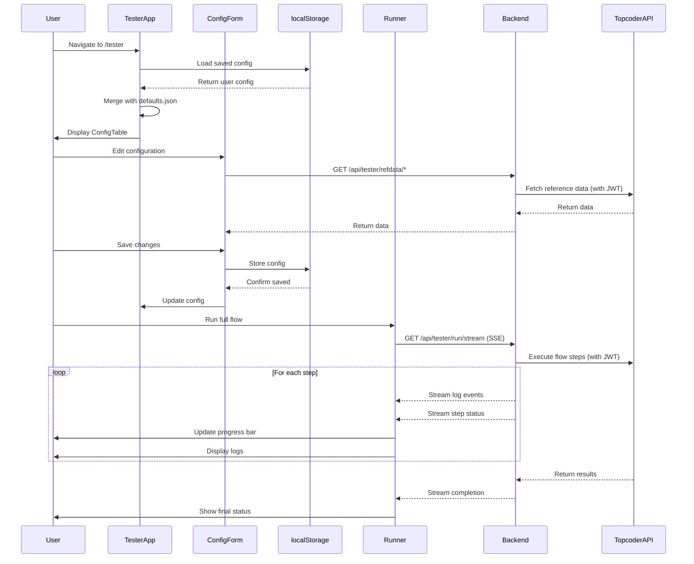

# Tester App

## Overview
The Tester App automates end-to-end challenge lifecycle testing for Topcoder's v6 platform. It creates, activates, and monitors challenges through all phases (registration, submission, review, appeals) while providing real-time progress tracking, streaming logs, and request/response debugging.

## Features
- **8 Flow Variants**: Full Challenge, First2Finish, Topgear Task, Topgear Task (Late), Design Challenge, Design Single, Design Fail Screening, Design Fail Review
- **Configuration Management**: Edit challenge settings, user handles, prizes, scorecards
- **localStorage Persistence**: User changes saved per browser, merged with defaults
- **Real-time Execution**: SSE streaming for logs, progress updates, step status
- **Request/Response Debugging**: Capture and inspect all API calls
- **JWT Authentication**: Secure access using platform-ui authentication

## Setup

### Prerequisites
- Node.js 22.13.0 (use nvm: `nvm use`)
- Yarn package manager
- Platform-ui running with authentication configured
- Access to Topcoder dev environment

### Tester Backend (qa-tester-service-v6)
The tester backend runs as a separate service in `qa-tester-service-v6`.
1. Follow `qa-tester-service-v6/README.md` to configure `.env` and start the service (defaults to `http://localhost:3001`).
2. Keep the service running while you use the Tester App.

### Platform-ui Environment
Set `REACT_APP_TESTER_API_URL` in your platform-ui environment (for example, `platform-ui/.env.local`) to point at the tester backend:
- Local: `http://localhost:3001/api`

### Starting the App
```bash
# Terminal 1: qa-tester-service-v6
yarn dev

# Terminal 2: platform-ui
yarn dev
```

Navigate to: `https://local.topcoder-dev.com/tester`

## Usage

### Selecting a Flow
Click on flow tabs to switch between:
- **Full Challenge**: Complete lifecycle with appeals
- **First2Finish**: Iterative submission/review until winner
- **Topgear Task**: Task with late submission support
- **Design Challenge**: Multi-phase design with checkpoints
- **Design Single**: Single-round design challenge

### Configuring a Flow
1. Click "Edit Configuration" button
2. Modify settings:
   - Challenge name prefix
   - Project ID
   - Challenge type and track (loads from Topcoder API)
   - Timeline template ID
   - User handles (copilot, reviewers, submitters)
   - Scorecards (loads based on type/track)
   - Prizes
3. Click "Save" to persist changes to localStorage

### Running a Flow
**Full Flow:**
- Click "Run full flow" to execute all steps
- Monitor progress bar and logs
- View challenge snapshot after creation

**Partial Flow:**
- Select a step from "Run to step" dropdown
- Click "Run to step" to stop at selected step
- Useful for testing specific phases

### Debugging
- Click on any step to view captured requests/responses
- Use "Copy" button to copy request/response JSON
- Check logs for detailed execution information

## Configuration Options

### Common Fields (All Flows)
- `challengeNamePrefix`: Prefix for challenge name (e.g., "Autopilot Test - ")
- `projectId`: Topcoder project ID (e.g., 100439)
- `challengeTypeId`: UUID of challenge type
- `challengeTrackId`: UUID of challenge track
- `timelineTemplateId`: UUID of timeline template
- `copilotHandle`: Copilot user handle
- `submitters`: Array of submitter handles
- `scorecardId`: Default scorecard ID
- `submissionZipPath`: Path to submission artifact

### Full Challenge / Design Single
- `reviewers`: Array of reviewer handles
- `submissionsPerSubmitter`: Number of submissions per submitter
- `prizes`: Array of prize amounts [1st, 2nd, 3rd]
- `screener`: Optional screener handle

### First2Finish / Topgear
- `reviewer`: Single reviewer handle
- `prize`: Single prize amount

### Design Challenge
- `reviewer`: Primary reviewer handle
- `screener`, `screeningReviewer`, `approver`: Phase-specific reviewers
- `checkpointScreener`, `checkpointReviewer`: Checkpoint phase reviewers
- `submissionsPerSubmitter`: Submissions per submitter
- `prizes`: Array of prize amounts
- `checkpointPrizeAmount`: Prize per checkpoint winner
- `checkpointPrizeCount`: Number of checkpoint prizes
- `reviewScorecardId`, `screeningScorecardId`, `approvalScorecardId`: Phase-specific scorecards
- `checkpointScorecardId`, `checkpointScreeningScorecardId`, `checkpointReviewScorecardId`: Checkpoint scorecards

## Flow Types

### Full Challenge (15 steps)
Complete challenge lifecycle with registration, submission, review, appeals, and appeals response phases.

**Steps:**
1. Token - Generate authentication token
2. Create Challenge - Create draft challenge
3. Update Draft - Configure challenge details
4. Activate - Activate challenge
5. Await Reg/Sub Open - Wait for registration/submission to open
6. Assign Resources - Assign copilot, reviewers, submitters
7. Create Submissions - Upload submissions
8. Await Review Open - Wait for review phase
9. Create Reviews - Generate reviews with scores
10. Await Appeals Open - Wait for appeals phase
11. Create Appeals - Submit appeals
12. Await Appeals Response Open - Wait for appeals response phase
13. Appeal Responses - Respond to appeals
14. Await All Closed - Wait for all phases to close
15. Await Completion - Wait for challenge completion and winner assignment

### First2Finish (10 steps)
Iterative submission and review process until a submission passes.

**Steps:**
1. Token
2. Create Challenge
3. Update Draft
4. Activate
5. Await Reg/Sub Open
6. Assign Resources
7. Load Submissions - Create initial submissions
8. Process Reviews - Review submissions iteratively
9. Final Submission - Submit winning submission
10. Await Winner - Wait for winner declaration

### Topgear Task (11 steps)
Task challenge with submission after deadline support.

**Steps:**
1-6. Same as First2Finish
7. Await Submission End - Wait until after submission deadline
8. Load Submissions
9. Process Reviews
10. Final Submission
11. Await Winner

### Topgear Task (Late) (10 steps)
Task challenge with immediate late submission (no waiting).

**Steps:** Same as First2Finish (no wait for submission end)

### Design Challenge (20 steps)
Multi-phase design challenge with checkpoint and final submissions.

**Steps:**
1-4. Same as Full Challenge
5. Await Reg/Checkpoint Open
6. Assign Resources
7. Create Checkpoint Submissions
8. Await Checkpoint Screening Open
9. Create Checkpoint Screening Reviews
10. Await Checkpoint Review Open
11. Create Checkpoint Reviews
12. Await Submission Open
13. Create Submissions
14. Await Screening Open
15. Create Screening Reviews
16. Await Review Open
17. Create Reviews
18. Await Approval Open
19. Create Approval Review
20. Await All Closed -> Await Completion

### Design Single (15 steps)
Single-round design challenge without checkpoint phase.

**Steps:**
1-6. Same as Full Challenge
7. Create Submissions
8. Await Screening Open
9. Complete Screening Reviews
10. Await Review Open
11. Create Reviews
12. Await Approval Open
13. Complete Approval Review
14. Await All Closed
15. Await Completion

### Design Fail Screening / Fail Review (20 steps)
Design challenges configured to intentionally fail at screening or review phase for testing failure handling.

**Steps:** Same as Design Challenge, but with failing scores

## API Endpoints

### Run Stream (SSE)
`GET /api/tester/run/stream?mode=full&flow=full&toStep=activate`

**Query Parameters:**
- `mode`: `full` (default) or `toStep`
- `flow`: Flow variant key
- `toStep`: Step ID to stop at (when mode=toStep)

**Response:** Server-Sent Events stream with log and step events

### Challenge Reviews
`GET /api/tester/challenges/:id/reviews`

Returns reviews for a challenge ID.

### Reference Data
- `GET /api/tester/refdata/challenge-types`
- `GET /api/tester/refdata/challenge-tracks`
- `GET /api/tester/refdata/scorecards?challengeType=Code&challengeTrack=DEVELOP`

## Authentication

All tester API endpoints require JWT authentication via:
- Cookies: `tcjwt`, `tctV3`
- Or Authorization header: `Bearer <token>`

The tester app uses the logged-in user's JWT token for all Topcoder API calls.

## Documentation Diagram



## Troubleshooting

### 401 Unauthorized
- Ensure you're logged in to platform-ui
- Check JWT token is valid and not expired
- Verify JWKS URL or JWT_SECRET is configured

### Reference Data Not Loading
- Check TC_API_BASE_URL is accessible
- Verify JWT token has required permissions
- Check browser console for CORS errors

### Flow Execution Fails
- Verify user handles exist in dev environment
- Check timeline template ID is valid
- Ensure project ID has required permissions
- Review logs for specific error messages

### localStorage Not Persisting
- Check browser allows localStorage
- Verify not in incognito/private mode
- Check browser storage quota

## Testing Summary

| Test Category | Total Tests | Passed | Failed | Notes |
|---------------|-------------|--------|--------|-------|
| Flow Execution | 8 | - | - | One test per flow type |
| localStorage | 5 | - | - | Persistence, per-flow, cross-browser, reset, merge |
| JWT Auth | 5 | - | - | Authenticated, unauthenticated, expiration, passing, validation |
| UI Components | 4 | - | - | ConfigTable, ConfigForm, Runner, Layout |
| Error Handling | 3 | - | - | Invalid config, network errors, API errors |
| Performance | 2 | - | - | SSE connection, localStorage |
| Browser Compat | 4 | - | - | Chrome, Firefox, Safari, Edge |

**Total:** 31 test scenarios

## Development

### File Structure
```
src/apps/tester/
├── src/
│   ├── config/
│   │   └── defaults.json          # Default configurations
│   ├── lib/
│   │   ├── components/            # UI components
│   │   ├── contexts/              # React contexts
│   │   ├── flows/                 # Flow definitions
│   │   ├── types/                 # TypeScript types
│   │   ├── models/                # Data models
│   │   ├── services/              # API services
│   │   └── utils/                 # Utility functions
│   ├── pages/                     # Page components
│   ├── TesterApp.tsx              # Main app component
│   └── tester-app.routes.tsx      # Route configuration
└── README.md
```

Backend services are now in the separate `qa-tester-service-v6` repository.
See: /home/jmgasper/Documents/Git/v6/qa-tester-service-v6/

### Adding a New Flow
1. Define flow steps in `src/apps/tester/src/lib/flows/flow-definitions.ts`
2. Add configuration type in `src/apps/tester/src/lib/types/config.types.ts`
3. Add default config in `src/apps/tester/src/config/defaults.json`
4. Implement flow runner in `qa-tester-service-v6/src/services/`
5. Update flow selection logic in `src/apps/tester/src/pages/flows/FlowsPage.tsx`

## Related Documentation
- [Platform UI README](../../../README.md)
- [QA Tester Service](../../../../qa-tester-service-v6/README.md)
- [Original Autopilot Tester](../../../../topcoder-autopilot-tester/README.md)
